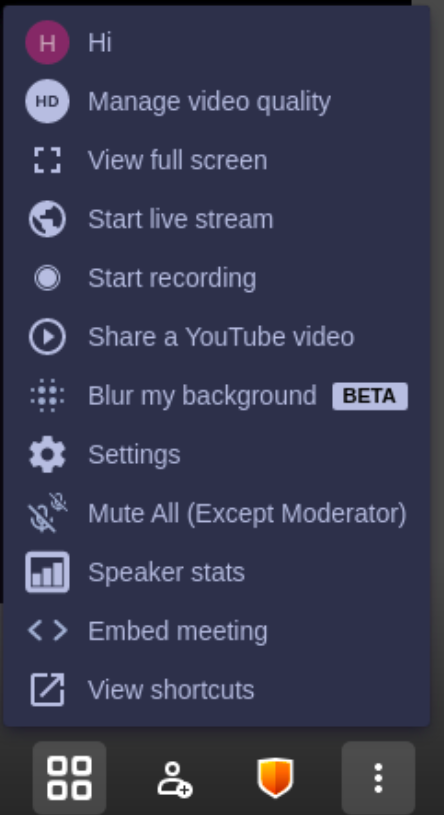
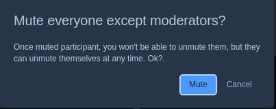
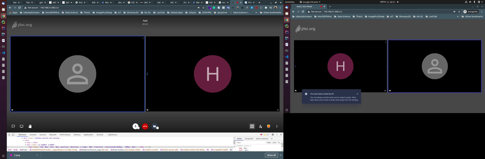
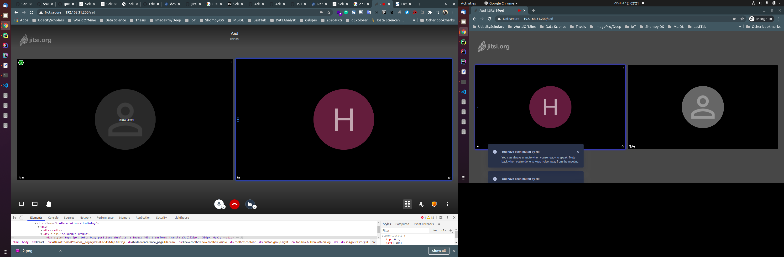

# Task: Add mute all except moderator in Jitsi Meet.

## _>Manual Installation(Ubuntu 20.04)
* Install prosody xmpp server
* Configuere the prosody xmpp server
* Install nginx
* Configure nginx with openssl self generate signed certificate
* Install jitsi-videobridge 
* Install jicofo (from sources)
* Build jitsi-meet-mod in the server

## _>Changes Files:
* add **'mute-everyone'** in jitsi-meet-mode/interface_config.js
```javascript
 TOOLBAR_BUTTONS: [
        'microphone', 'camera', 'closedcaptions', 'desktop', 'embedmeeting', 'fullscreen',
        'fodeviceselection', 'hangup', 'profile', 'chat', 'recording',
        'livestreaming', 'etherpad', 'sharedvideo', 'settings', 'raisehand',
        'videoquality', 'filmstrip', 'invite', 'feedback', 'stats', 'shortcuts',
        'tileview', 'videobackgroundblur', 'download', 'help', 'mute-everyone', 'security'
    ],
```
* changes some notification title in **jitsi-meet-mode/lang/main.json**
* create new function named **muteAllParticipantsExceptModerator** at **jitsi-meet-mod/react/features/remote-video-menu/actions.js**
```javascript
export function muteAllPartic ipantsExceptModerator(exclude: Array<string>) {
    return (dispatch: Dispatch<any>, getState: Function) => {
        const state = getState();
        const localId = getLocalParticipant(state).id;
        const participantIds = state['features/base/participants']
            .map(p => p.id);

        const participant = state['features/base/participants'].map(p => p);;

        /* eslint-disable no-confusing-arrow */
        // participantIds
        //     .filter(id => !exclude.includes(id))
        //     .map(id => id === localId ? muteLocal(true) : muteRemote(id))
        //     .map(dispatch);
        // participantIds
        //     // .filter(id => !exclude.includes(id))
        //     .map(id => isParticipantModerator(id) ? muteLocal(false) : muteRemote(id))
        //     .map(dispatch);
        console.log(participant);
        participant
            .map(p => (p.role === "moderator") ? muteLocal(false) : muteRemote(p.id))
            .map(dispatch);
        /* eslint-enable no-confusing-arrow */
    };
}

```
* Call **muteAllParticipantsExceptModerator** from **jitsi-meet-mod/react/features/remote-video-menu/components/web/MuteEveryoneDialog.js**
```javascript 
    dispatch(muteAllParticipantsExceptModerator(exclude));
```
## Screenshots
* Step 1: Click Mute All(Except Moderator)<br>
 
* Step 2: Confirmation Dialog<br>

* Step 3: Before Confirmation (All participant's mic is on)<br>

* Step 4: Before Confirmation (All participant's mic is off except Moderator)<br>



## _>Inspired by [Github gimre/jitsi-meet!](https://github.com/gimre/jitsi-meet)


# Jitsi Meet - Secure, Simple and Scalable Video Conferences

Jitsi Meet is an open-source (Apache) WebRTC JavaScript application that uses [Jitsi Videobridge](https://jitsi.org/videobridge) to provide high quality, [secure](https://jitsi.org/security) and scalable video conferences. Jitsi Meet in action can be seen at [here at the session #482 of the VoIP Users Conference](http://youtu.be/7vFUVClsNh0).

The Jitsi Meet client runs in your browser, without installing anything else on your computer. You can try it out at https://meet.jit.si.

Jitsi Meet allows very efficient collaboration. Users can stream their desktop or only some windows. It also supports shared document editing with Etherpad.

## Installation

On the client side, no installation is necessary. You just point your browser to the URL of your deployment. This section is about installing a Jitsi Meet suite on your server and hosting your own conferencing service.

Installing Jitsi Meet is a simple experience. For Debian-based system, following the [quick install](https://jitsi.github.io/handbook/docs/devops-guide/devops-guide-quickstart) document, which uses the package system. You can also see a demonstration of the process in [this tutorial video](https://jitsi.org/tutorial).

For other systems, or if you wish to install all components manually, see the [detailed manual installation instructions](https://jitsi.github.io/handbook/docs/devops-guide/devops-guide-manual).

Installation with Docker is also available. Please see the [instruction](https://jitsi.github.io/handbook/docs/devops-guide/devops-guide-docker).

## Download

| Latest stable release | [](https://github.com/jitsi/jitsi-meet/releases/latest) |
|---|---|

You can download Debian/Ubuntu binaries:
* [stable](https://download.jitsi.org/stable/) ([instructions](https://jitsi.org/downloads/ubuntu-debian-installations-instructions/))
* [testing](https://download.jitsi.org/testing/) ([instructions](https://jitsi.org/downloads/ubuntu-debian-installations-instructions-for-testing/))
* [nightly](https://download.jitsi.org/unstable/) ([instructions](https://jitsi.org/downloads/ubuntu-debian-installations-instructions-nightly/))

You can download source archives (produced by ```make source-package```):
* [source builds](https://download.jitsi.org/jitsi-meet/src/)

### Mobile apps

* [Android](https://play.google.com/store/apps/details?id=org.jitsi.meet)

[](https://play.google.com/store/apps/details?id=org.jitsi.meet)

* [Android (F-Droid)](https://f-droid.org/en/packages/org.jitsi.meet/)

[](https://f-droid.org/en/packages/org.jitsi.meet/)

* [iOS](https://itunes.apple.com/us/app/jitsi-meet/id1165103905)

[](https://itunes.apple.com/us/app/jitsi-meet/id1165103905)

You can also sign up for our open beta testing here:

* [Android](https://play.google.com/apps/testing/org.jitsi.meet)
* [iOS](https://testflight.apple.com/join/isy6ja7S)

## Release notes

Release notes for Jitsi Meet are maintained on [this repository](https://github.com/jitsi/jitsi-meet-release-notes).

## Development

For web development see [here](https://jitsi.github.io/handbook/docs/dev-guide/dev-guide-web), and for mobile see [here](https://jitsi.github.io/handbook/docs/dev-guide/dev-guide-mobile).

## Contributing

If you are looking to contribute to Jitsi Meet, first of all, thank you! Please
see our [guidelines for contributing](CONTRIBUTING.md).

## Embedding in external applications

Jitsi Meet provides a very flexible way of embedding in external applications by using the [Jitsi Meet API](doc/api.md).

## Security

The security section here was starting to feel a bit too succinct for the complexity of the topic, so we created a post that covers the topic much more broadly here: https://jitsi.org/security

The section on end-to-end encryption in that document is likely going to be one of the key points of interest: https://jitsi.org/security/#e2ee

## Security issues

For information on reporting security vulnerabilities in Jitsi Meet, see [SECURITY.md](./SECURITY.md).

## Acknowledgements

Jitsi Meet started out as a sample conferencing application using Jitsi Videobridge. It was originally developed by ESTOS' developer Philipp Hancke who then contributed it to the community where development continues with joint forces!
